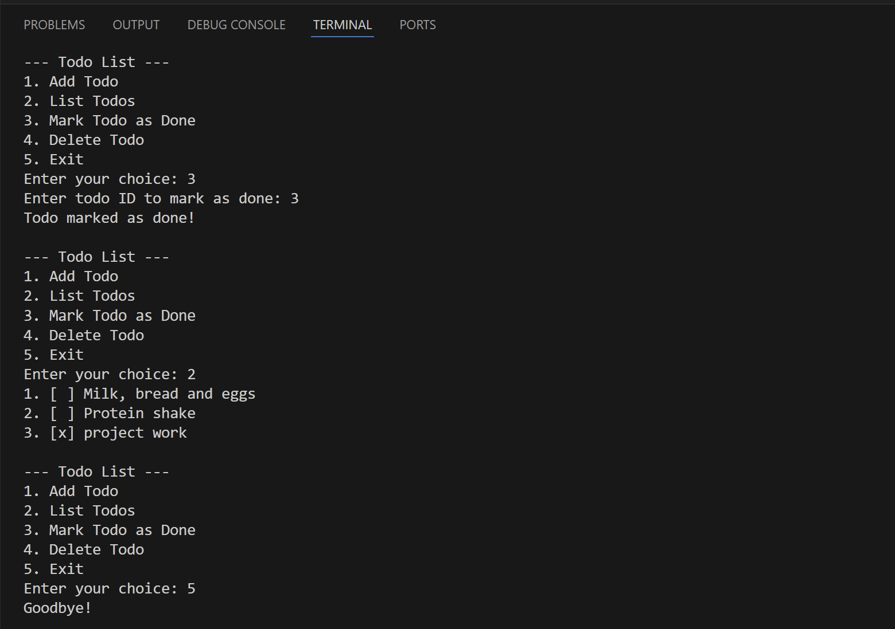

# ai teaches golang (AI-Assisted GoLang Learning Journey)

This repository documents my journey of learning Go (Golang) with the assistance of AI tools like Perplexity. It contains various small projects and code samples that demonstrate different aspects of Go programming.

## Projects

### 1. Go Todo CLI

A simple command-line todo list application demonstrating basic Go concepts like structs, slices, and user input handling.



## Repository Structure

- `ai-teaches-golang/`: Contains initial Go programs and experiments
- `go-todo/`: A simple command-line todo application
- (More project folders to be added)

Each folder contains its own `go.mod` file and main Go file(s) for the respective project.

## Prerequisites

- Go (version 1.x or later)
- Git

## Setup

1. Clone this respository.

2. Ensure Go is installed and added to your system's PATH.

## Running Programs

To run any Go program in this repository:

1. Navigate to the project directory: `cd project-name`
2. Run the Go file: `go run filename.go`


For example, to run the todo application:

```
cd go-todo
go run todo-cli.go
```

## Learning Resources

- [Official Go Documentation](https://golang.org/doc/)
- [Go by Example](https://gobyexample.com/)
- AI assistance from Perplexity

## Contributing

While this is a personal learning repository, suggestions and tips are welcome! Feel free to open an issue for discussion.

## License

This project is open source and available under the [Apache License](LICENSE).
